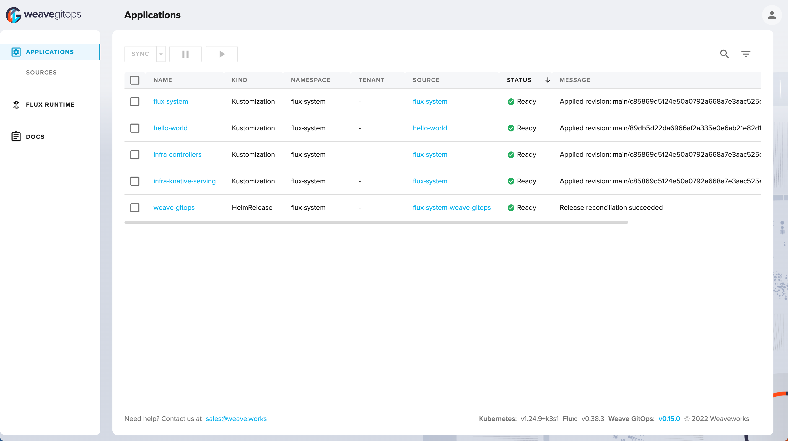

# Hello World!, the GitOps way

A demo to show case how to deploy the traditional Hello World application using [GitOps](https://www.gitops.tech/). The goal of this demo is to get started with GitOps on your laptops, understand its principles etc.,

The demo will leverage [flamingo](https://github.com/kameshsampath/flamingo) to allow us to use either [FluxCD](https://fluxcd.io) or [ArgoCD](https://argo-cd.readthedocs.io/) as our GitOps platform, leveraging the power of both.

## What is Required ?

### Tools

Download and add the following tools to your `$PATH`,

- [Task](https://taskfile.dev/)
- [Flux CLI](https://fluxcd.io/flux/installation/#install-the-flux-cli)
- [ArgoCD CLI](https://argo-cd.readthedocs.io/en/stable/cli_installation/)
- [K3D](https://k3d.io)
- [Docker Desktop](https://www.docker.com/products/docker-desktop/)
- [GitHub CLI](https://github.com/cli/cli)
- [yq](https://github.com/mikefarah/yq)

>**IMPORTANT**: Ensure all the tools are available on your `$PATH` before proceeding further.

### GitHub

- [GitHub PAT](https://docs.github.com/en/authentication/keeping-your-account-and-data-secure/creating-a-personal-access-token)
  
- A GitHub user to fork the GitOps Demo Fork

### Environment Variables

Copy `$GITOPS_DEMO_HOME/.env.example` --> `$GITOPS_DEMO_HOME/.env` and update the `.env` to update `$GITHUB_USER`, `$GITHUB_TOKEN`. Leave the `HELLO_WORLD_APP_FORK_REPO` as it is we will update it later.

Load the environment variables on to current shell. Open a terminal window and navigate to `$GITOPS_DEMO_HOME` and run,

```shell
source .env
```

**(OR)**

```shell
task reload_env
```

Test if all the variables are loaded successfully,

```shell
# should return the directory where you have cloned this demo sources
echo $GITOPS_DEMO_HOME
```

## Create Cluster

Run the following command to create local kubernetes([k3s](https://k3s.io)) cluster,

```shell
task create_cluster
```

If all went well running the command `kubectl cluster-info` should show a similar output,

```text
Kubernetes control plane is running at https://0.0.0.0:62779
CoreDNS is running at https://0.0.0.0:62779/api/v1/namespaces/kube-system/services/kube-dns:dns/proxy
Metrics-server is running at https://0.0.0.0:62779/api/v1/namespaces/kube-system/services/https:metrics-server:https/proxy
```

## Bootstrap

The demo setup will have the following core infrastructure components,

- Flux     - the GitOps platform
- Flamingo - the Flux Subsystem for Argo(FSA)
- Knative  - the serverless platform to deploy our services

Run the following command to bootstrap FluxCD and all other infrastructure components,

> ***TIP**: All the commands we run as part of this demo has task associated. E.g. The following bootstrap command can be run using `task bootstrap`. Check the [Taskfile](./Taskfile.yml) for th detailed command that gets executed.

```shell
task bootstrap
```

The command does the following,

- `flux install` - installs fluxcd on to the cluster
- `kubectl apply -k $GITOPS_DEMO_HOME/flamingo` - installs FSA

>**NOTE**: It will take few mins for bootstrap to complete, depending upon your bandwidth.

Open the Flamingo dashboard using the url <https://127.0.0.1:30080>, use the credentials `admin` and password printed during the bootstrap.

>**TIP**: You can change the admin password using `argocd account update-password`

The following sections ensure all the required infrastructure components are up and running,

### Knative

Deploy the infrastructure `knative` Argo CD application,

```shell
task create_knative_app
```

Synchronize the application,

```shell
argocd app sync knative
```

Wait for few mins for the application to be synchronized, a successful sync will have `knative` application on argocd dashboard


```shell
watch kubectl get pods -n knative-serving
```

```shell
NAME                                     READY   STATUS      RESTARTS   AGE
domainmapping-webhook-78d8f55ff-gbvvk    1/1     Running     0          100s
webhook-d44b476b8-lwtnx                  1/1     Running     0          100s
autoscaler-6c94f894f7-wwxbf              1/1     Running     0          100s
activator-56948b7c57-hmx76               1/1     Running     0          100s
controller-8c6b99cb7-v2mfw               1/1     Running     0          100s
net-kourier-controller-c748f7c64-q7cdg   1/1     Running     0          100s
domain-mapping-9fd944b76-8zdk9           1/1     Running     0          100s
default-domain-9l96p                     0/1     Completed   0          100s
```

#### Knative Ingress Check

```shell
kubectl describe configmap/config-network --namespace knative-serving
```

Should display an output like,

```text
...(trimmed for brevity)
ingress-class:
----
kourier.ingress.networking.knative.dev
...
```

#### Knative Domain Check

```shell
kubectl describe configmap/config-domain --namespace knative-serving | less
```

Should display an output like,

```text
...(trimmed for brevity)
Data
====
127.0.0.1.sslip.io:
----
...
```

#### Deploy test app

```shell
cat <<EOF | kubectl apply -f -
apiVersion: serving.knative.dev/v1 # Current version of Knative
kind: Service
metadata:
  name: helloworld-go # The name of the app
  namespace: default # The namespace the app will use
spec:
  template:
    spec:
      containers:
        - image: gcr.io/knative-samples/helloworld-go # The URL to the image of the app
          env:
            - name: TARGET # The environment variable printed out by the sample app
              value: "All set to deploy Hello World, the GitOps way!!!"
EOF
```

Wait for the service to be ready,

```shell
watch kubectl get ksvc
```

It will take few seconds for the service to be ready, a ready service should show an output like,

```text
NAME            URL                                               LATESTCREATED         LATESTREADY           READY   REASON
helloworld-go   http://helloworld-go.default.127.0.0.1.sslip.io   helloworld-go-00001   helloworld-go-00001   True
```

If all went well you can cURL the service,

```shell
curl http://helloworld-go.default.127.0.0.1.sslip.io:30080
```

It will return a response like `Hello All set to deploy Hello World, the GitOps way!!!!`.

Clean up the test service using the command,

```shell
kubectl delete ksvc helloworld-go
```

## Deploy Hello World Application

Let's create the required GitOps resources for deploying <https://github.com/kameshsampath/go-hello-world>.

## Fork Application Repo

```shell
cd "$GITOPS_DEMO_HOME/work"
gh repo clone https://github.com/kameshsampath/go-hello-world
cd go-hello-world
export HELLO_WORLD_APP_FORK_REPO=$(gh repo view --json url -q '.url')
```

Let us call your <https://github.com/kameshsampath/go-hello-world> fork as `$HELLO_WORLD_APP_FORK_REPO`.

Edit the file `$GITOPS_DEMO_HOME/argo-hello-world/argo/apps/hello-world.yaml` and update the `https://github.com/kameshsampath/go-hello-world` to point to `$HELLO_WORLD_APP_FORK_REPO`.

Save, commit and push the code.

## Deploy Application using GitOps

As we will be using kustomize to deploy the application, let us create the Flux kustomization resource that will watch for manifest changes on Git repository `$HELLO_WORLD_APP_FORK_REPO`,

```shell
kubectl apply -k $GITOPS_DEMO_HOME/argo/apps/hello-world.yaml
```

A successful sync should show the `hello-world` application on Argo CD dashboard,



Call the service using cURL,

```shell
curl http://hello-world.default.127.0.0.1.sslip.io:30080/
````

```json
{
  "Prefix": "Hello",
  "Name": "",
  "Message": "Hello,"
}
```

**(OR)** 

```shell
curl http://hello-world.default.127.0.0.1.sslip.io:30080?name=Newton
```

```json
{
  "Prefix": "Hello",
  "Name": "Newton",
  "Message": "Hello,Newton"
}
```

### Induce a change

As part of this change we will make the service use the greeting prefix as **Hi**. To do that we will update the service containers environment variable `GREETING_PREFIX`.

Edit the file `$GITOPS_DEMO_HOME/apps/hello-world/kustomization.yaml` and update it to look as shown,

```yaml
---
apiVersion: kustomize.toolkit.fluxcd.io/v1beta2
kind: Kustomization
metadata:
  name: hello-world
  namespace: flux-system
spec:
  interval: 5m0s
  path: ./config/serverless
  prune: true
  sourceRef:
    kind: GitRepository
    name: hello-world
  targetNamespace: default
  patches:
    - patch: |-
        apiVersion: serving.knative.dev/v1
        kind: Service
        metadata:
          name: hello-world
        spec:
          template:
            spec:
              containers:
                - env:
                    - name: GREETING_PREFIX
                      value: Hi
                  image: docker.io/kameshsampath/go-hello-world
      target:
        name: hello-world
        namespace: default
        group: serving.knative.dev
        version: v1
        kind: Service
```

Save, commit and push the changes back to `argo-hello-world` repository. The push should trigger as sync in few seconds.

Open a new terminal and watch for the `hello-world` service,

```shell
watch kubectl get ksvc hello-world
```

In few seconds you should see the service revision changing from `hello-world-00001` to `hello-world-00002`,

```shell
NAME          URL                                             LATESTCREATED       LATESTREADY
       READY   REASON
hello-world   http://hello-world.default.127.0.0.1.sslip.io   hello-world-00002   hello-world-0
0002   True
```

Lets call the service again,

```shell
curl http://hello-world.default.127.0.0.1.sslip.io:30080?name=Newton
```

```json
{
  "Prefix": "Hi",
  "Name": "Newton",
  "Message": "Hi,Newton"
}
```

>**TIP**: You can also check the commit has that is currently applied via the Web Console. To get commit has run the command `git log --pretty=oneline`

## Cleanup

```shell
task delete_cluster
```

## References

- [ArgoCD Guides](https://argo-cd.readthedocs.io/en/stable/user-guide/)
- [FluxCD Guides](https://fluxcd.io/flux/)
- [Flamingo](https://github.com/flux-subsystem-argo/flamingo)
  